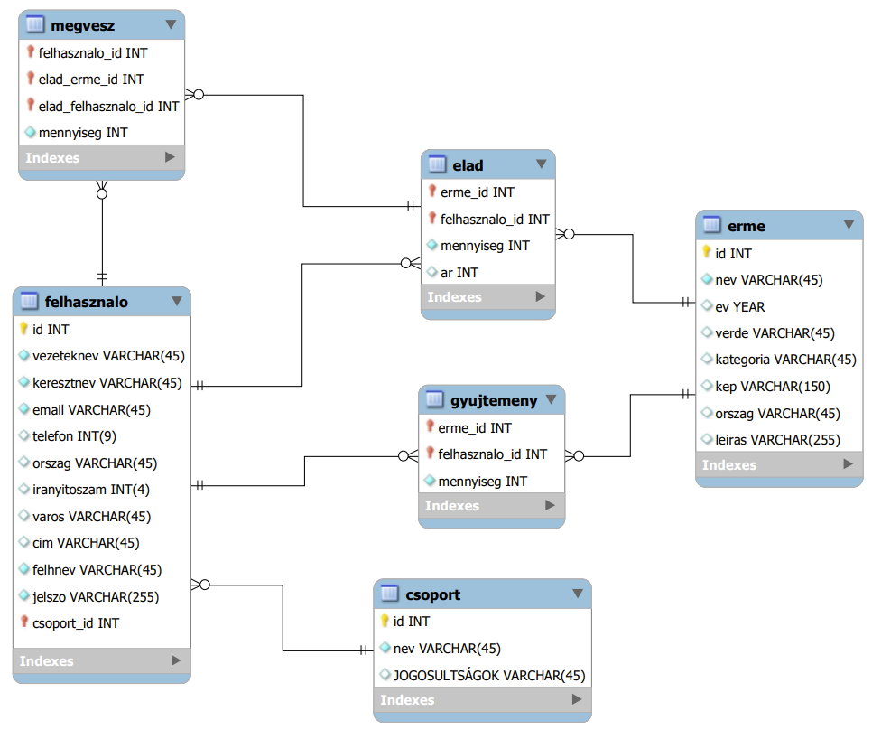

### Az adatbázis sémája

### Elérhető oldalak és funkciók listája

- Kezdőlap
    - Hírek, aktualitások
    - Bejelentkezés
- Érmék
    -  Az adatbázisban szereplő érmék listázása
    -  Új érmék felvétele (jogosultság függvényében)
    -  Érme hozzáadása a saját gűjteményhez
-  Saját gyűjteményem
    - Gyűjtemény megtekintése
    - Érmék számának módosítása, törlés a gyűjteményből
    - Érme kínálása eladásra
- Vásártér
  - Eladó érmék listázása
  - Vételi szándék jelzése
  - Bejövő megrendelések listázása
- Tagok kezelése
    - Az adatbázisban tárolt tagok listázása
    - Tagok adatainak módosítása
    - Tagok törlése

#### Felhasználók
- Az elérhető jogosultsági körök
    - adminisztrátor
    - kereskedő (a vásártérhez és a gyűjteményhez is hozzáfér)
    - gyűjtő (csak a saját gyűjteményét és az adatbázisban szereplő érméket látja)

- A jelszavak az adatbázisban titkosított formában vannak eltárolva.
